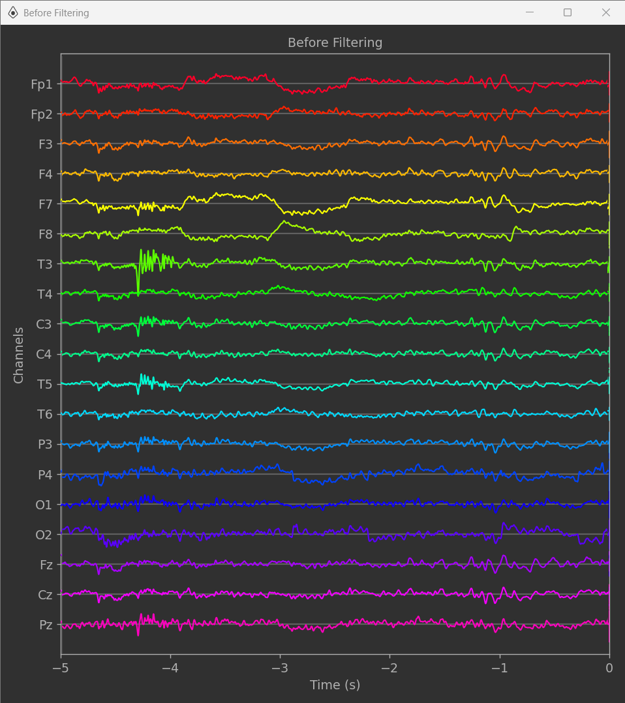
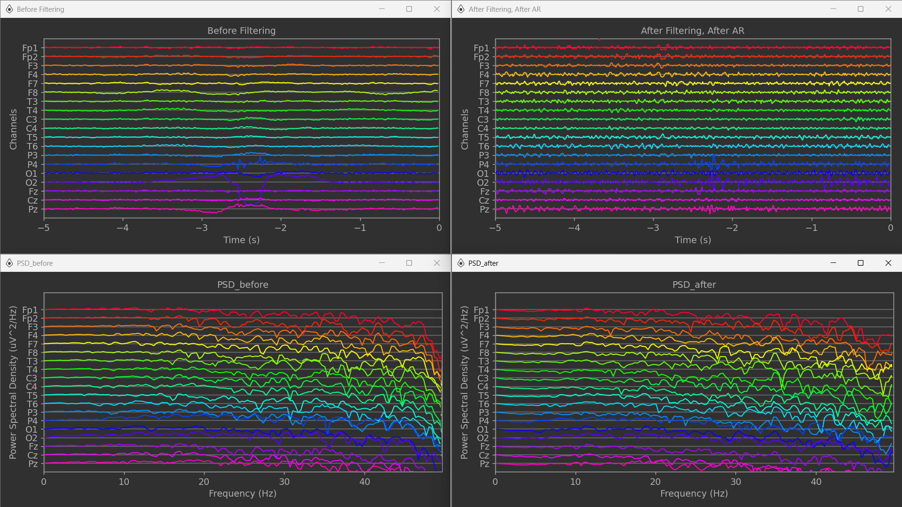
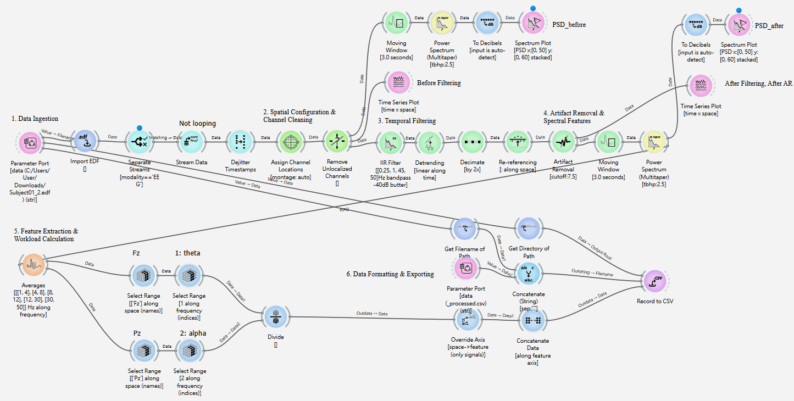
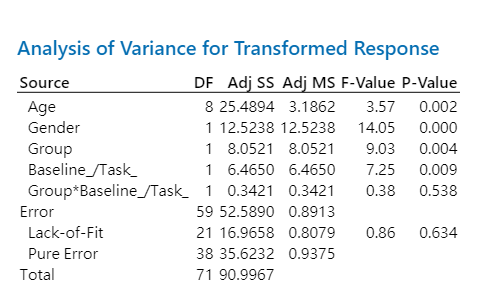
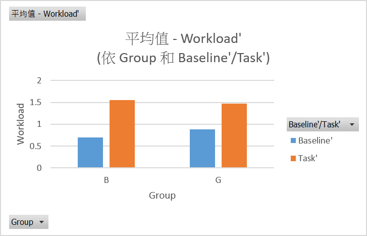
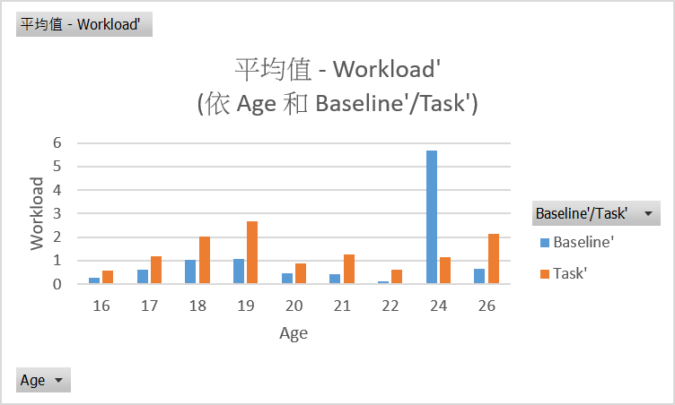
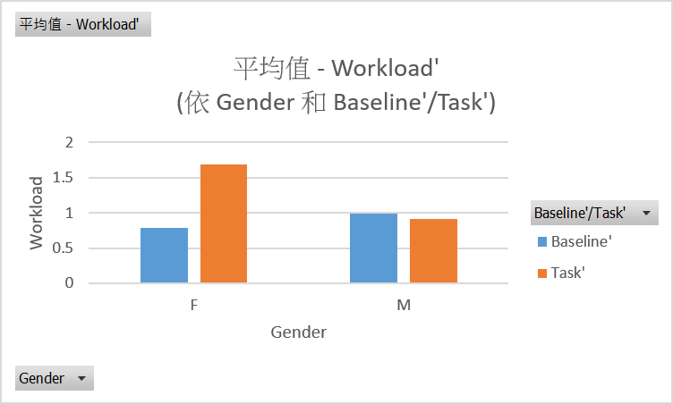

# EEG Spectral Correlates of Cognitive Load During Mental Arithmetic: A Rest–Task Comparison

## 1. Introduction

###  Project Overview & Context

This project investigates **cognitive load** and **working memory control** during mental arithmetic using electroencephalography (EEG). The selected EEGMAT database contains EEG recordings collected before and during mental arithmetic tasks. 

In each trial, participants performed serial subtraction after hearing a four-digit minuend and a two-digit subtrahend. This task engages several key human information processing functions: maintaining the current number in working memory, retrieving arithmetic rules, updating intermediate results, inhibiting irrelevant information, and sustaining attention throughout the calculation. Consequently, the mental arithmetic condition represents a state of elevated cognitive load compared with the background resting state.

### Objectives & Core Hypotheses

The primary objective is to evaluate whether EEG spectral features **differ between the background and arithmetic-task conditions**, and whether workload-related EEG patterns vary between the dataset’s **good-counting** and **bad-counting** groups. The condition comparison focuses on task-related changes in neural activity, while the group comparison examines whether participants with different arithmetic performance levels show different workload patterns. 

> **Research Hypotheses:**
> We hypothesize that mental arithmetic will increase theta-band power, particularly at frontal regions such as **Fz**, because frontal theta activity is commonly associated with working memory demands, executive control, and cognitive effort. Conversely, we expect suppressed alpha-band power at parietal regions such as **Pz**, reflecting increased attentional engagement and active information processing.

### Analyzed EEG Indices

The core EEG indices analyzed in this project are power spectral density (PSD), frequency-specific band powers, and a cognitive workload ratio. 

>According to Holm et al. (2009), mental workload can be defined by the ratio of Theta band power at the frontal-midline channel (Fz) to Alpha band power at the parietal-midline channel (Pz):
>
>$$\text{Mental Workload} = \frac{\text{Theta}_{\text{Fz}}}{\text{Alpha}_{\text{Pz}}}$$
>
>A higher Theta/Alpha ratio directly indicates an increased level of mental workload. 

Specifically, frontal theta power (4–8 Hz) at Fz and parietal alpha power (8–12 Hz) at Pz are extracted to compute a **theta/alpha workload index**. These frequency-domain measures are appropriate because changes in neural oscillatory activity can reflect the cognitive resources required for working memory updating, sustained attention, and executive control during mental arithmetic.

## 2. Data Description

### Data Source

- The dataset utilized in this project is the “EEG During Mental Arithmetic Tasks” (EEGMAT), version 1.0.0, hosted on the PhysioNet database.
- [URL](https://physionet.org/content/eegmat/1.0.0/ "EEG During Mental Arithmetic Tasks")
- The dataset contains EEG recordings collected before and during mental arithmetic task performance.
- Each subject has two EDF files: the “_1” file represents the background EEG recorded before the task, while the “_2” file represents the EEG recorded during the mental arithmetic task.
- The dataset consists of EEG recordings from 36 participants, divided into a good-quality counting group and a bad-quality counting group.

### Recording Device Info.

- Neurocom EEG 23-channel system (XAI-MEDICA, Ukraine), sampling rate = 500 Hz.
- Electrodes were placed according to the International 10–20 system.

### Original Purpose

This dataset was originally collected to investigate EEG activity before and during mental arithmetic task performance. The serial subtraction task was designed to induce an intensive cognitive workload condition, allowing comparison between background resting-state EEG and task-state EEG. The dataset also includes good-counting and bad-counting groups, which allows analysis of EEG differences related to arithmetic performance quality.

## 3. Data Preprocessing

### Visual Inspection & Artifact Identification

  

The figure shows the EEG time-series signal before filtering. A short transient high-amplitude fluctuation was observed around -4.3 s, especially in channels such as T3, C3, T5, P3, and Pz. This pattern may indicate a residual movement-related artifact, brief muscle activity (EMG), or temporary electrode instability.  

### Spectral & Time-Series Proof

  

## 4. NeuroPype Pipeline

This is the screenshot of `HIP_Group5_Final.pyp` NeuroPype file:

  

To assess data preprocessing, the following nodes were used: 

### Data Ingestion

  -  **Parameter Port**, Import EDF: Specifies the file path and imports raw .edf EEG data into the pipeline.
  - Separate Streams: Isolates cortical EEG signals by filtering out non-EEG data streams.
  - **Stream Data**: Controls playback to ensure each data segment is processed once *without looping*.
  - **Dejitter Timestamps**: Corrects timing irregularities to maintain a stable, equal-interval sampling rate.

### Spatial Configuration & Channel Cleaning

  - **Assign Channel Locations**: Maps electrode labels to their standard 3D spatial coordinates.
  - **Remove Unlocalized Channels**: Discards unmapped hardware channels that lack defined coordinates.

### Temporal Filtering

  - **IIR Filter**: Applies a *[0.25, 1, 45, 50] Hz Butterworth bandpass filter* to isolate core Theta and Alpha waves (1–45 Hz) while smoothly attenuating low-frequency DC drift and 50 Hz power line noise. 
  - **Detrending**: Removes linear baseline drift to center the signal around zero volts.
  - **Decimate**: Downsamples the signal by half to optimize computational efficiency.
  - **Re-referencing**: Normalizes channels against a common spatial baseline to remove global noise.

### Artifact Removal & Spectral Features

  - **Artifact Removal**: Eliminates ocular and muscle artifacts using a *30-second calibration phase*, tailored to the short duration (~60 seconds) of each recording. 
  - **Moving Window**: Segments continuous EEG data into overlapping *3.0-second epochs* for localized analysis.
  - **Power Spectrum (Multitaper)**: Computes high-resolution power spectral density while minimizing spectral leakage.

### Feature Extraction & Workload Calculation

  - **Averages**: Computes average power across defined frequency ranges to extract standard brainwave bands (Delta, Theta, Alpha, Beta, Gamma).
  - **Select Range (Fz & theta)**: Isolates the specific Theta band frequency index from the frontal-midline (Fz) spatial channel.
  - **Select Range (Pz & alpha)**: Isolates the specific Alpha band frequency index from the parietal-midline (Pz) spatial channel.
  - **Divide**: Calculates the mental workload index by dividing the extracted Fz Theta power by the Pz Alpha power.

### Data Formatting & Exporting

  - **Override Axis**: Remaps the data dimension from a spatial axis to a feature axis to prepare the workload matrix for tabular export.
  - **Concatenate Data**: Combines multiple processed data streams along the feature axis into a single, unified dataset.
  - **Parameter Port, Get Path Properties, Concatenate (String)**: Extracts the source directory and file metadata to dynamically generate the output file path.
  - **Record to CSV**: Exports the final concatenated data array into a structured CSV file at the designated storage location.

Following the input of two EDF files for each participant, the mean workload for each participant during each trial was calculated from the output CSV files and recorded in the **'Original'** sheet of the `analysis_toMinitab.xlsx` file. 

Preliminary observations indicated that the workload values within most time windows ranged between 0 and 1.5. In the event of sudden spikes or outliers, they were attributed to either residual eye movement artifacts (causing a sharp surge in the Theta band) or Alpha blocking (where the Alpha band approaches zero). 

After filtering out these outliers from each session, a revised mean workload, denoted as *workload'* (and represented as `workload_` in subsequent statistical analyses), was computed and documented in the **'delete outlier'** sheet. Subsequently, statistical analyses were conducted in Minitab using the **Box-Cox transformed** *workload'* data, which exhibited a normal distribution and homogeneity of variance.

## 5. Demo Video

- [URL](https://drive.google.com/file/d/1r2qlEXUnIubAAvCHv7Er_kutqF-_O44t/view?usp=sharing "Demo Video")

## 6. Results & Interpretation

This study conducted a multi-way Analysis of Variance (ANOVA), incorporating four main factors—`Age`, `Gender`, `Group`, and `Baseline_/Task_`—as well as the interaction effect of `Group * Baseline_/Task_`. According to the ANOVA table, we can find that the P-Value of `Age`, `Gender`, `Group`, and `Baseline_/Task_` are **lower than 0.05**, so we have sufficient evidence to say that these four factors affect workload. 

  

The bar charts show that the workload values under ‘task’ conditions are generally higher than baseline.

  
  
  

This study has a limitation ― there were 27 female subjects and 9 male subjects, and most of them were in the same age group. As a result, our interpretation will focus on `Group` and `Baseline/Task.`*

- `Group`

  For the high-performing group, tasks such as continuous serial subtraction fall well within the comfortable capacity of their working memory. Because they possess better mathematical proficiency and calculation strategies, they can complete a large number of calculations with a lower and more stable level of Theta synchronization. This demonstrates a "proficient and effortless" neural state, resulting in a relatively lower calculated workload value. Conversely, the poor-performing group easily faces the dilemma of "cognitive overload" when confronted with mental arithmetic tasks. To overcome bottlenecks during calculation, their brains must work excessively hard, leading to a spike in frontal Theta waves, which causes the higher workload value.

- `Baseline/Task`

  During the baseline period, the subject is in a relatively relaxed state. At this time, the Alpha band in the cerebral cortex exhibits strong neuronal synchronization, while Theta band power remains low. When performing tasks, the brain must engage working memory for information processing. This leads to Alpha band suppression and simultaneously triggers frontal Theta synchronization. Because Theta power increases while Alpha power decreases under task conditions, the Theta/Alpha ratio naturally exhibits an escalation. Therefore, the workload value of the task is higher than the baseline.

In short, this study reveals that mental workload is driven by two distinct dimensions:

- **Task Demands** : The increase in the Theta/Alpha ratio during the mental arithmetic task clearly reflects the brain shifting from relaxed alertness to active executive processing.

- **Individual Capability** : The workload gap between the groups highlights the role of neural efficiency. High performers achieve superior results effortlessly due to efficient cognitive strategies and lower Theta power. Conversely, low performers face severe cognitive overload, triggering a sharp surge in frontal Theta activity as their brains overwork to compensate for task difficulties.

---

## Credits 

- Course: NTHU Human Information Processing (2026)
- Developed and published by Group 5

No modification, redistribution, or commercial use of this work is permitted without explicit prior written consent from the authors. This project is hosted on GitHub strictly for educational and viewing purposes.
